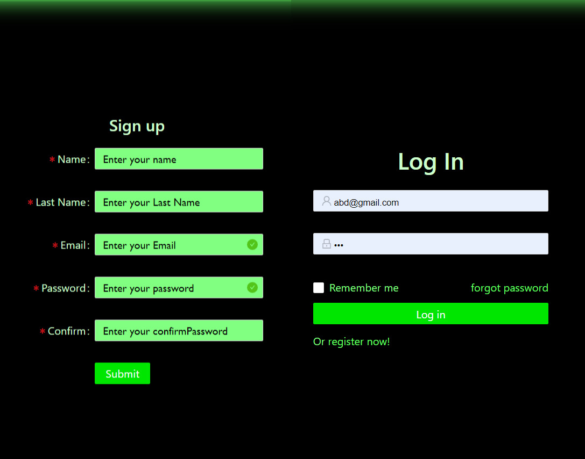

# Travel App

<p align="center">

</p>

### This is a Travel Booking site made using MERN Stack.

<br> <br>

## Installation
### Clone the repo

```
git clone https://github.com/hhhrrrttt222111/TravelApp.git
cd TravelApp
```
### Install Server packages from the root directory
```
npm install
```
### Install Client packages
```
cd client
npm install
```

<br>

## Usage
### Create `dev.js` file inside `./server/config` and add your MongoDB connection string into `dev.js` file as shown below.
```
module.exports = {
    mongoURI: "mongodb+srv://<username>:<password>@cluster0.podra.mongodb.net/<dbname>?retryWrites=true&w=majority"
}
```
### Create an empty folder named `uploads` in the root directory for storing images.

<br>

## Run from the root directory
```
npm run dev
```

<br><br>

## Snapshots

 * ### Landing Page
<p align="center">
 
</p>
<br> 

 * ### Place Details Page
<p align="center">
 
</p>
<br> 

 * ### Cart Page
<p align="center">
 
</p>

<br>

 * ### SignIn/LogIn
<p align="center">
 
</p>

<br ><br ><br >

## Packages Used

| Server Side Packages  | Client Side Packages  |
| :-------------: | :-------------: |
| async  | antd  |
| bcrypt  | axios  |
| body-parser  | formik  |
| cookie-parser  | moment  |
| cors  | react  |
| express  | react-dom  |
| jsonwebtoken  | react-dropzone  |
| moment  | react-icons  |
| mongoose  | react-image-gallery  |
| multer  | react-paypal-express-checkout  |
| react-redux  | react-redux  |
| socket.io  | react-router-dom  |
| concurrently  | react-scripts  |
| nodemon  | redux  |
|   | redux-form  |
|   | redux-promise  |
|   | redux-thunk  |
|   | socket.io-client  |
|   | yup |
|   | babel-plugin-import  |
|   | http-proxy-middleware  |
|   | less  |
|   | less-loader |


